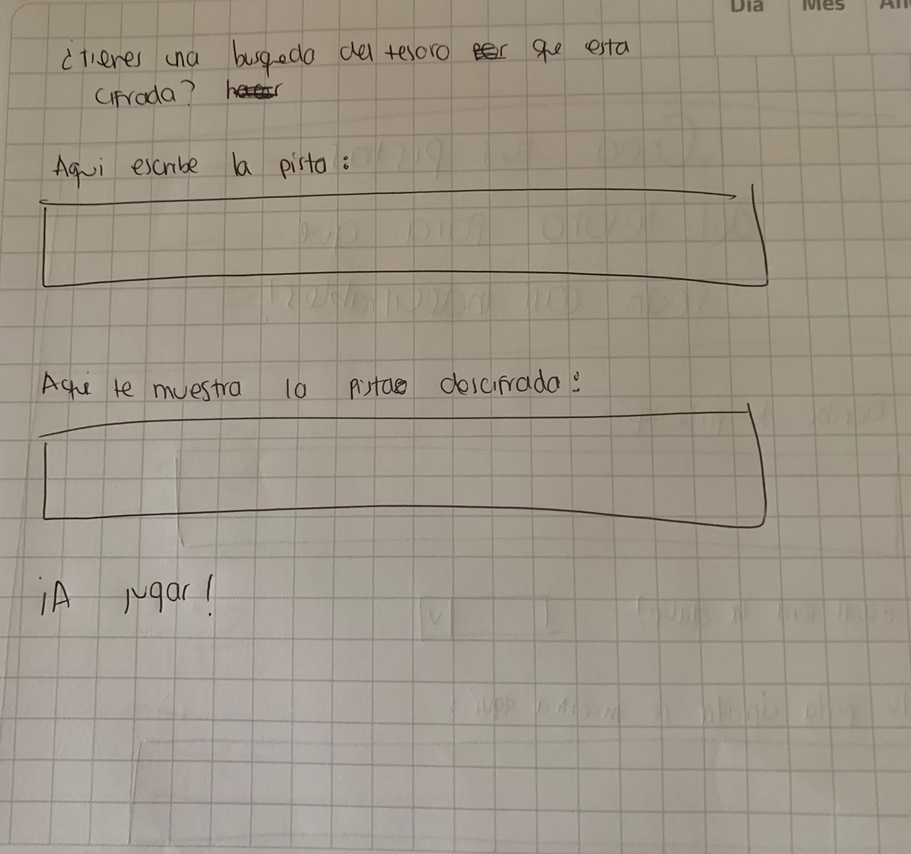
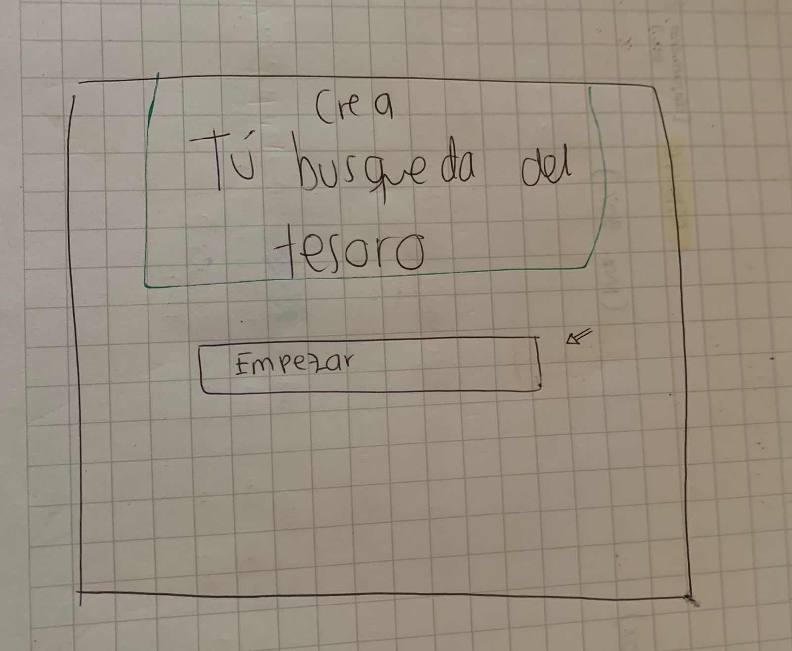
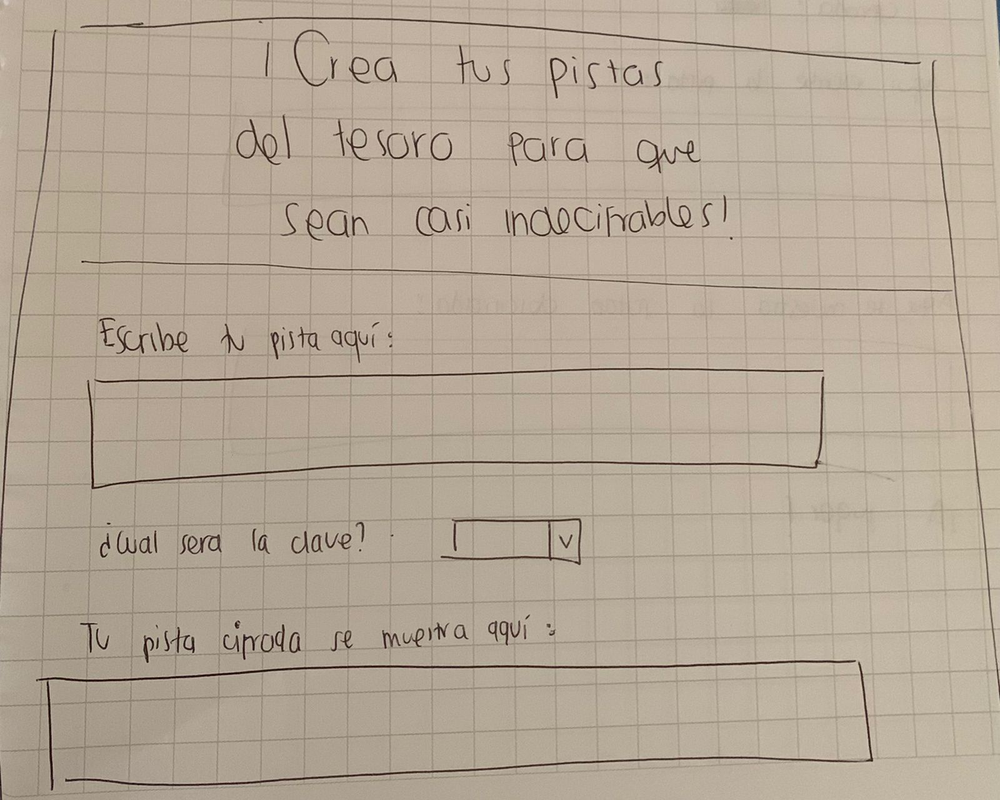

# Cifrado César

## ¿Qué es "Treasures Clues"?

Es una aplicación web diseñada con el objetivo de ayudarte con tu búsqueda del tesoro. Este juego es uno de los más divertidos para las familias y amigos, ya que pasan tiempo juntos intentando solucionar y descifrar cada una de las pistas para llegar a ese gran tesoro. También es una gran idea para entregar un regalo de una forma muy creativa. 

Por lo tanto, sabemos que para realizar una búsqueda del tesoro que sea más entretenida para tu familia y amigos ¡es necesario hacer pistas mas dificiles de entender!, por lo que nuestra página te ayudará a cifrar esas pistas que tienes en mente. Y si eres quien busca el tesoro, esta herramienta te ayudará a descifrar las pistas para encontrar el tesoro rápidamente.

## ¿Quienes pueden utilizar "Treasure Clues"?

¡Es para todas las edades! Nuestra herramienta fue creada para que desde un joven hasta un adulto puedan entender facilmente como utilizarla. Si eres quien organiza la búsqueda, solo debes tener creatividad para crear tus pistas con una clave secreta y esconder el tesoro. Si eres el jugador, solo necesitarás la pista encriptada para empezar e intentar descifrarla.

¡Solo debes darle click al boton "Empezar"!

### Proceso y decisiones de diseño:

El primer paso fue pensar sobre el uso y el tema que tendría la herramienta. Ya después de tener claro para que sería util mi aplicacion web, empecé a realizar un prototipo de baja fidelidad, pensando en una estructura básica para cifrar y descifrar el texto. 

Luego de realizar una estructura básica en el código HTML, diseñé un prototipo de alta fidelidad en la aplicacion Figma con el fin de organizar y diseñar todo lo relacionado a los colores, estructura de los elementos, pagina de bienvenida, etc. De esta manera, tener en mente como quisiera que se visualizara mi página y que podría utilizar para empezar darle forma desde CSS.

*[Click para ver Prototipo de alta fidelidad](https://www.figma.com/proto/Ik8lDIAokwIjxvXBp7zv2f/Prototipo-alta-fidelidad-cipher?node-id=2%3A2&scaling=min-zoom&page-id=0%3A1)

En lo siguiente, me enfoqué en la funcionalidad de cifrar y descifrar (realizando test unitarios y pásandolos).

Finalmente, realicé la pagina de bienvenida que llevará mediante el boton "Empezar" al usuario hacia la página principal donde podrá cifrar y descifrar sus pistas. Esto con el fin de crear "un llamado a la accion" para llegar a la pagina principal y la funcionalidad de la herramienta.

-A través del proceso, los prototipos que principalmente realicé fueron mejorando por medio de la retroalimentación de otras personas, por lo cual optimicé muchos detalles visuales y técnicos que no tenía estructurados en mis primeros prototipos.

